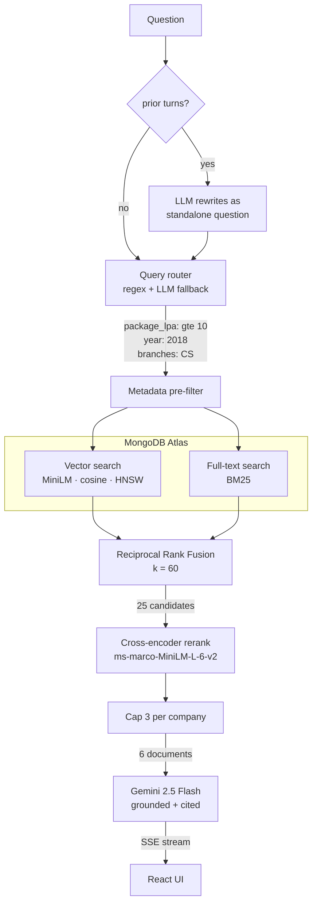

# Placement RAG Assistant

A retrieval-augmented question answering system over campus recruitment records.
Students ask in plain English — *"I have 7 CGPA and no backlogs, what am I eligible
for?"* — and get a cited answer instead of scrolling a spreadsheet.

The interesting part is not that it calls an LLM. It's the retrieval pipeline:
structured filter extraction, hybrid vector + BM25 search fused with Reciprocal
Rank Fusion, cross-encoder reranking, and a golden-set evaluation harness that
measures whether any of it actually helps.

---

## Why hybrid retrieval

Pure vector search leaves whole classes of question on the table, and tuning `k`
fixes none of them:

| Question | Why vector search alone falls short | Fix |
| --- | --- | --- |
| *"companies above 10 LPA"* | `above 10 LPA` and `above 5 LPA` embed almost identically — the threshold simply isn't in the vector | extract the constraint, push it to the DB as a pre-filter |
| *"which years did Capgemini recruit?"* | the answer lives in an aggregate, not in any single row | index company-profile documents alongside record documents |
| *"CS companies in 2018 above 12 LPA"* | three constraints at once; semantic similarity ranks the survivors badly | BM25 as a second opinion, fused by rank |

Measured below: hybrid retrieval takes aggregate questions from 0.50 to 1.00 and
multi-constraint questions from 0.33 to 1.00.

The pipeline runs both retrievers, fuses them by rank, then reorders the survivors
with a model that actually reads the query and the document together.



---

## Retrieval evaluation

33 questions across seven categories, three configurations, same golden set.
Reproduce with `uv run python backend/eval/run_eval.py --all-configs`.

| Configuration | hit-rate@k | precision@k | MRR | median latency |
| --- | --- | --- | --- | --- |
| Vector only (cosine) | 0.833 | 0.556 | 0.753 | 106 ms |
| + BM25 hybrid (RRF) | 0.967 | 0.600 | 0.807 | 128 ms |
| + cross-encoder rerank | 0.967 | 0.617 | 0.903 | 837 ms |

Hybrid search doesn't just nudge the average — it fixes two whole question types:

| Question type | vector | hybrid | hybrid_rerank |
| --- | --- | --- | --- |
| aggregate (n=4) | 0.50 | 1.00 | 1.00 |
| eligibility (n=6) | 1.00 | 1.00 | 1.00 |
| exact_name (n=6) | 1.00 | 1.00 | 1.00 |
| multi_constraint (n=3) | 0.33 | 1.00 | 1.00 |
| numeric_filter (n=6) | 0.83 | 0.83 | 0.83 |
| semantic (n=5) | 1.00 | 1.00 | 1.00 |

Reading it honestly:

* **BM25 hybrid** is what rescues aggregate questions (*"which years did Capgemini
  recruit?"*) and multi-constraint questions. Exact-name questions were already at
  1.00 for pure vector search on this corpus, because the company name appears
  verbatim in the document text — the lexical leg earns its place elsewhere.
* **The cross-encoder finds nothing new** — hit-rate is identical at 0.967. What it
  does is *order* better: MRR goes 0.807 → 0.903, meaning the right record moves to
  the top instead of sitting at rank 3. That costs ~700 ms, which is the trade-off,
  and why it is a config flag rather than a hard-coded stage.


Recall is deliberately not reported: *"companies above 10 LPA"* has 235 relevant
records, so `recall@6` would cap at 0.026 regardless of how good retrieval is —
it would measure the question, not the system.

---

## Stack

| Layer | Choice | Why |
| --- | --- | --- |
| Vector store | MongoDB Atlas Vector Search | records and vectors in one database, and BM25 on the same collection |
| Embeddings | `all-MiniLM-L6-v2` (384-d) | runs on CPU in milliseconds, 80 MB |
| Reranker | `cross-encoder/ms-marco-MiniLM-L-6-v2` | bi-encoder for recall, cross-encoder for precision |
| LLM | Gemini 2.5 Flash | fast, cheap, streams |
| Orchestration | LangChain (LCEL) | retriever and chain composition |
| API | FastAPI + SSE | token streaming, typed request/response |
| Frontend | React 18 + TypeScript + Vite + Tailwind v4 | streaming chat, citation cards, retrieval trace |

---

## Layout

```
backend/
  app/
    core/config.py          env-driven settings (pydantic-settings)
    api/routes/chat.py      POST /api/chat — SSE stream
    api/routes/meta.py      /api/health, /api/stats, /api/companies
    rag/
      embeddings.py         the one place the embedding model is constructed
      documents.py          CSV rows -> record + company-profile documents
      ingest.py             idempotent embed & upsert
      query_router.py       natural language -> MongoDB filters
      retriever.py          filter -> hybrid -> rerank -> diversify
      rerank.py             cross-encoder
      chain.py              condense -> retrieve -> grounded answer -> stream
  scripts/
    enrich_dataset.py       builds the synthetic eligibility layer
    build_indexes.py        creates both Atlas indexes
  eval/
    golden_set.json         33 questions with metadata predicates
    run_eval.py             hit-rate@k, precision@k, MRR
frontend/                   React + TS + Vite + Tailwind
```

---

## Setup

Requires Python 3.12+, Node 18+, and a MongoDB Atlas cluster (the free M0 tier is
enough — it supports both index types).

```bash
git clone https://github.com/suyash503/placement-rag.git
cd placement-rag
```

```bash
cp .env.example .env
```

Fill in `MONGO_URI` and `GEMINI_API_KEY` ([Google AI Studio](https://aistudio.google.com/)).
Add your IP under Atlas → Network Access.

```bash
uv sync
```

Build the dataset, create the indexes, then ingest:

```bash
uv run python backend/scripts/enrich_dataset.py
```

```bash
uv run python backend/scripts/build_indexes.py
```

```bash
uv run python backend/app/rag/ingest.py
```

Ingestion embeds ~4,700 documents locally on CPU and takes a few minutes. It is
idempotent — re-running updates in place rather than duplicating.

Run the API:

```bash
uv run uvicorn backend.app.main:app --reload
```

And the frontend, in a second terminal:

```bash
cd frontend && npm install && npm run dev
```

Open http://localhost:5173. API docs are at http://localhost:8000/docs.

---

## Data

The company, college, region and year columns are real: 2,764 recruitment drives
across 27 engineering colleges in Mumbai, Navi Mumbai, Thane and Pune, 2014–2018,
covering 1,966 companies after name normalisation.

**Everything else is synthetic.** Package, CGPA cutoff, eligible branches, 10th/12th
percentages, backlog policy, selection rounds, role and location are generated by
`backend/scripts/enrich_dataset.py`, because the source export contained none of
them. Values are derived from a hash of `(company, college, year)` — deterministic,
and correlated rather than random: package tracks company tier and drifts with
year, CGPA cutoff tracks package, branch sets follow what the company does.

Realistic enough to build and evaluate retrieval against. **Not real placement
statistics, and not usable for any actual decision.**
